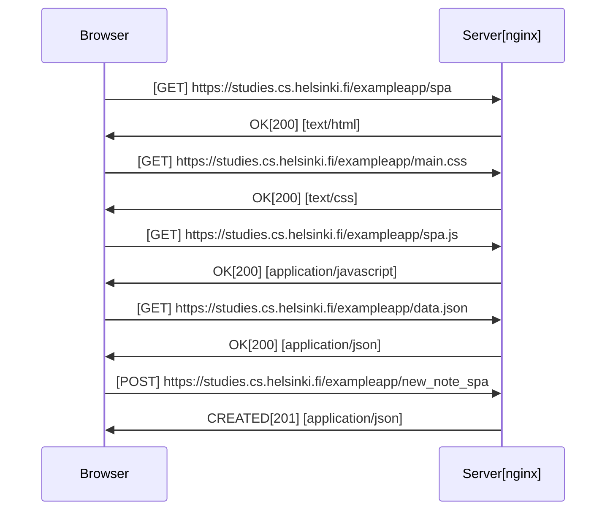

```mermaid
sequenceDiagram
    participant Browser
    participant Server[nginx]
    Browser->>Server[nginx]: [GET] https://studies.cs.helsinki.fi/exampleapp/spa
    Server[nginx]->>Browser: OK[200] [text/html]
    Browser->>Server[nginx]: [GET] https://studies.cs.helsinki.fi/exampleapp/main.css
    Server[nginx]->>Browser: OK[200] [text/css]
    Browser->>Server[nginx]: [GET] https://studies.cs.helsinki.fi/exampleapp/spa.js
    Server[nginx]->>Browser: OK[200] [application/javascript]
    Browser->>Server[nginx]: [GET] https://studies.cs.helsinki.fi/exampleapp/data.json
    Server[nginx]->>Browser: OK[200] [application/json]
    Browser->>Server[nginx]: [POST] https://studies.cs.helsinki.fi/exampleapp/new_note_spa
    Server[nginx]->>Browser: CREATED[201] [application/json]
```
